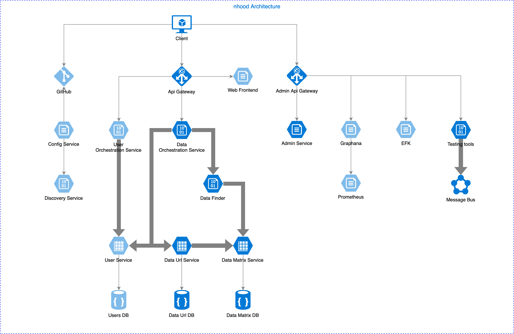

# nhood

## Problem

`nhood` (for neighborhood) is a data search engine based on a shortest geometrical distances between multidimensional metadata vectors. Engine maintains an universe of data with n-dimensional vectors of metadata as data description. On search the geometrically nearest objects are resolved and returned. 

## Use-cases

1. A resolution of nearest geographical locations around the user.

1. A resolution of content relevant to user preferences.

## Goal

The engine implementation if focused on:

- high performance
- resilience
- reactiveness
- cloud-nativeness

## Architecture

System architecture is based on containerized microservices principles. All of the components should be considered as a separate services that may consist of single or multiple instances of application container. Inter-service communication is based on a messaging/event bus. Service discovery, load balancing, container life cycle management is supported by container orchestration technology. 

## Key Libraries

- `Core Engine`: 

    A library with core implementation of `nhood` algorithms.
    
   Repository: https://github.com/nhood-org/nhood-engine
   
     

## Key Services

### Data layer services

- `Data URL Service`: 

    Simple CRUD data abstraction service for data url entities.
    
   Repository: https://github.com/nhood-org/nhood-data-url-svc 

      

- `Data Matrix Service`: 

    Service maintaining a model of n-dimensional data grid, grouped into small and easy-to-compute data grid chunks, optimized for retrieval of data by vector elements.
    
   Repository: https://github.com/nhood-org/nhood-data-matrix-svc
   
      

### Engine services

- `Data Orchestrations Service`: 

    Service for orchestration of data registration and data resolution.
    
   Repository: https://github.com/nhood-org/nhood-data-orchestration-svc 
   
     

- `Data Finder`: 

    Engine service resolving nearest data.

### Frontal services

- `Api Gateway`: 

    Frontal gateway for web application

    Repository: https://github.com/nhood-org/nhood-api-gateway

     

- `Admin Api Gateway`: 

    Frontal gateway exposing auxiliary UI consoles

- `Web Frontend`: 

    Container with web application

### Auxiliary services

- `Admin Service`:

    Spring Boot admin service

- `Discovery Service`:

    Eureka supporting Admin and Configuration services

- `Configuration Service`:

    Remote configuration provider

Other Repositories: 

- Maven repository: https://github.com/nhood-org/nhood-repository

- Parent BOM: https://github.com/nhood-org/nhood-parent-bom

      
    
- Parent Service BOM: https://github.com/nhood-org/nhood-parent-service-bom

      

- Docker integration: https://github.com/nhood-org/nhood-docker-integration

       
    
- Messaging testing tool: https://github.com/nhood-org/nhood-messaging-testing-tool
     
     

## Technology

Core parts of implementation are based on:

- Java 11
- Spring Boot 2.1.x stack
- Spring Framework 5, Spring Cloud, Project Reactor, RSocket
- Couchbase, R2DBC
- Docker, Docker Compose, Docker Swarm/Kubernetes
- JUnit5, Spock

## Contribution

Would you like to contribute to `nhood` project? Feel free to have a look [here](./CONTRIBUTING.md).

## Road map

Road map may be found [here](./ROADMAP.md).

## Project board

Project board may be found [here](https://github.com/orgs/nhood-org/projects/1?fullscreen=true).

## License

All nhood components and documentation is released under the MIT license:
- https://opensource.org/licenses/MIT
